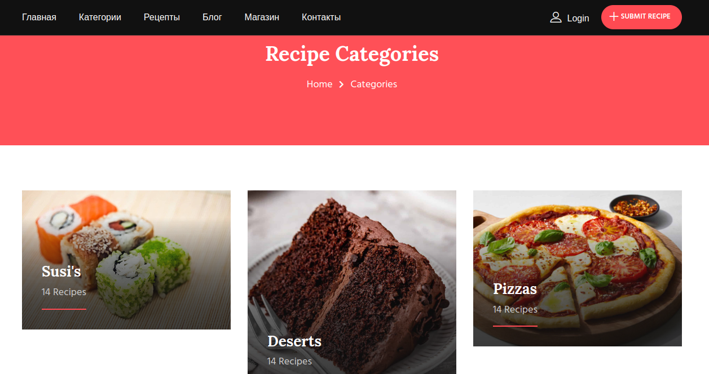

# FoodTales

Этот проект представляет собой веб-приложение на основе Django 4.1, разделенное на два основных приложения:

- **accounts:** Приложение для управления пользователями, аутентификации и авторизации.
- **blog:** Приложение для создания и отображения статей блога.

## О проекте

FoodTales - это платформа для публикации кулинарных рецептов, деления опытом приготовления блюд и обмена впечатлениями о кулинарных подвигах.

### Основные функции

- Создание и публикация рецептов.
- Авторизация пользователей и управление профилями.
- Отображение списка и деталей рецептов.

## Запуск проекта

Чтобы запустить проект локально, выполните следующие шаги:

1. Установите необходимые зависимости:
   ```bash
   pip install -r requirements.txt
   python manage.py migrate
   python manage.py runserver

2. После выполнения этих шагов вы сможете открыть приложение в вашем браузере по адресу 
    http://127.0.0.1:8000/.

